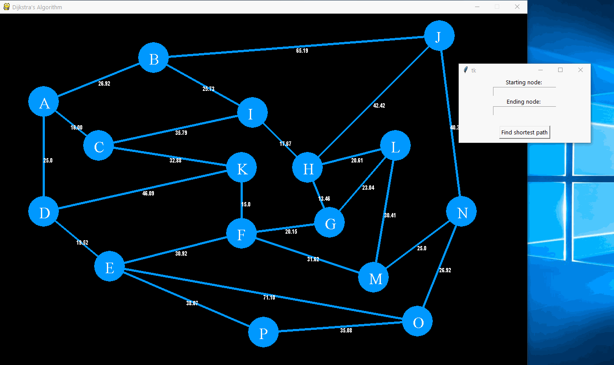

# Dijkstra's Shortest Path Algorithm

## Introduction
This project aims to use Dijkstra's algorithm to find the shortest path between any two nodes for the given wieghted graph. A graphical user interface will allow the user to view the graph and input the two nodes to find the shortest path for. The output is the length of the shortest path and the set of nodes that form the shortest path.
## Requirements
 - Python 3.x
 - Tkinter
 - Pygame
## Example

## What I learned
I learned how to implement Dijkstra's algorithm and how to combine the algorithm logic with a GUI and visualization. 

